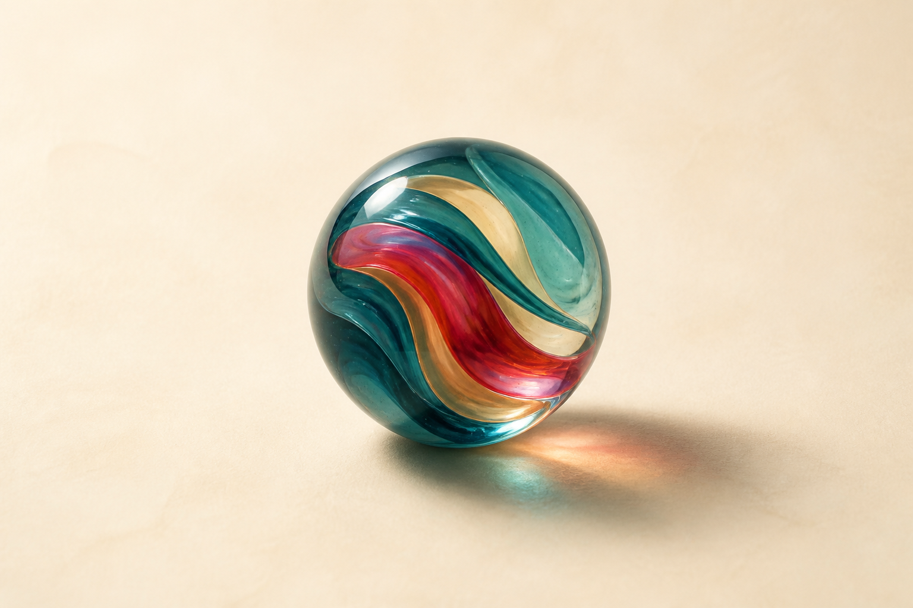

# Homepage Interactive Marble Hero - Design Spec

Status: PRIORITY DRAFT
Phase: 08 - UI/UX DESIGN
Source decision: DEC-003

این تصویر فقط مرجع Material، Palette و Lighting است. Asset نهایی باید Real-time یا لایه‌ای باشد تا Rotation واقعی را نشان دهد و به تصویر تخت وابسته نماند.

## Initial viewport

- Header حداکثر 72px.
- تیله بزرگ دقیقاً در مرکز ناحیه بصری قرار دارد.
- H1 حداکثر دو خط: «بازی مناسب، برای همین لحظه.»
- Subtext حداکثر ۲۰ واژه.
- CTA اصلی «چی بازی کنیم؟» بدون Scroll دیده می‌شود.
- Hero حداکثر چهار عنصر متنی دارد و Trust/Featureها پایین‌تر می‌روند.

## Marble anatomy

- Glass shell با Fresnel highlight و inner refraction
- یک Ribbon اصلی Petrol و یک Accent کنترل‌شده Ruby/Peach
- Contact shadow و Caustic مستقل برای حس وزن
- Poster fallback با همان silhouette و palette
- Hit target مستقل از pixelهای شفاف و حداقل 160px در Mobile

## Interaction states

- Idle: چرخش ۸ تا ۱۴ ثانیه‌ای و تنفس نور بسیار کم
- Pointer proximity: جهت‌گیری نرم تا حداکثر ۸ درجه، نه دنبال‌کردن تهاجمی Cursor
- Hover/focus: highlight و Cursor affordance، بدون تغییر اندازه شدید
- Drag: pointer capture، چرخش 1:1 محدود، Momentum نرم پس از release
- Touch: drag تک‌انگشتی فقط پس از شروع روی Marble؛ Scroll بیرون Marble آزاد می‌ماند
- Keyboard: Focus روی کنترل، Arrowها rotation step، Home بازگشت به وضعیت پایه
- Active: Cursor/feedback واضح و CTA مستقل

Click ساده بدون drag یک impulse چرخش کوتاه می‌دهد. Click نباید Navigation یا Start را فعال کند.

## Motion budget

- هدف Desktop: 60fps؛ کف قابل قبول 45fps پیش از Quality downgrade
- هدف INP کل صفحه: کمتر از 200ms
- frame work از React/DOM render cycle جدا نگه داشته می‌شود
- DPR و optical layers روی دستگاه ضعیف کاهش می‌یابند
- Animation هنگام hidden tab متوقف می‌شود
- WebGL failure: CSS layered marble یا poster، بدون حذف CTA

## Accessibility

- Label: «تیله تعاملی؛ برای چرخاندن از کلیدهای جهت‌دار استفاده کنید.»
- reduced-motion: Marble ثابت با highlight غیرمتحرک؛ Pointer و Momentum خاموش
- کنترل تیله قبل از CTA در Focus قرار نمی‌گیرد مگر ترتیب خواندن آن را توجیه کند؛ CTA مسیر اصلی باقی می‌ماند.
- Contrast Copy و CTA روی همه فریم‌های حرکت ثابت می‌ماند.

## Acceptance

1. Pointer جهت‌گیری نرم و محدود را نشان می‌دهد.
2. Drag/Touch Rotation مستقیم و قابل توقف است.
3. Click کوتاه یک Spin impulse ایجاد می‌کند.
4. Keyboard و reduced-motion معادل قابل استفاده دارند.
5. CTA در 320px، 768px، 1024px و 1440px قابل مشاهده و قابل کلیک است.
6. Fallback بدون WebGL هویت و Function را حفظ می‌کند.
