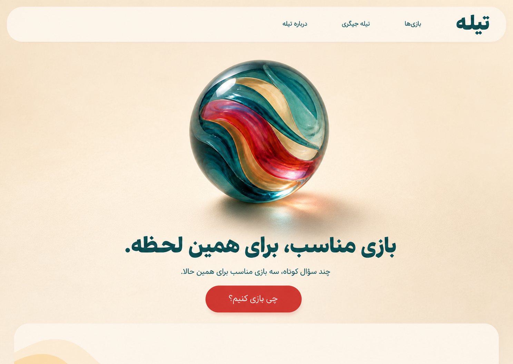
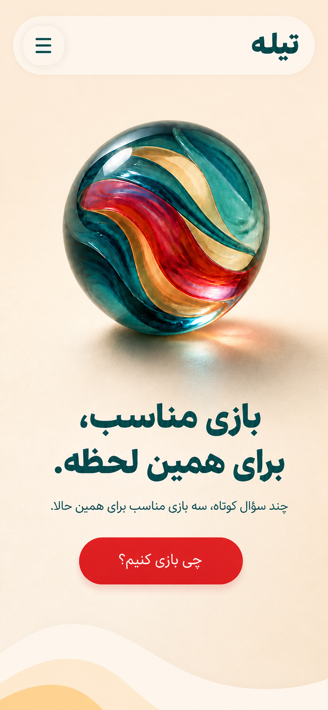

# Homepage Visual Prototype v1

Status: CLOSED - SUPERSEDED BY APPROVED V4
Phase: 08 - UI/UX DESIGN
Type: HIGH-FIDELITY STATIC MOCKUP

این خروجی نمونه دیداری است و هنوز سایت قابل اجرا نیست. هدف آن تأیید Composition، رنگ، Typography، Material تیله و جایگاه CTA پیش از معماری و Laravel Implementation است.

## Desktop

## Mobile

## تصمیم‌های نشان‌داده‌شده

- تیله شیشه‌ای بزرگ در مرکز واقعی Hero
- Palette رسمی Cream، Petrol، Peach و Ruby
- Header یک‌خط در Desktop و Menu فشرده در Mobile
- یک CTA اصلی با Label ثابت «چی بازی کنیم؟»
- Hero بزرگسال‌محور، گرم و بازیگوش بدون ظاهر مهدکودکی
- نمایش CTA در First viewport
- فضای کافی پیرامون تیله برای Pointer و Drag interaction

## چیزهایی که تصویر ثابت نشان نمی‌دهد

- Ambient rotation
- چرخش محدود رو به Pointer
- Click spin impulse
- Drag/Touch rotation و Momentum
- Keyboard controls
- reduced-motion و fallback

رفتارهای بالا در `09-homepage-hero-spec.md` قرارداد شده‌اند و در Prototype تعاملی بعد از UI/UX Gate و Architecture پیاده می‌شوند.

## Review checklist

- [ ] مرکز و اندازه تیله تأیید شود.
- [ ] سلسله‌مراتب H1، توضیح و CTA تأیید شود.
- [ ] حس Adult-facing و نه Childish تأیید شود.
- [ ] نسخه Mobile در عرض هدف تأیید شود.
- [ ] Dark-mode visual variant طراحی و بررسی شود.
- [ ] Quick Match screen family با همین Design language طراحی شود.
