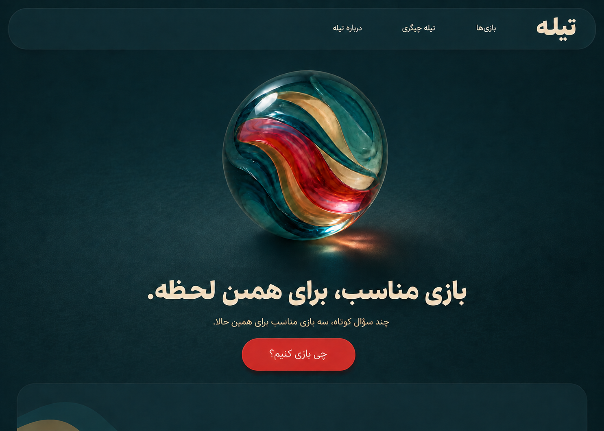
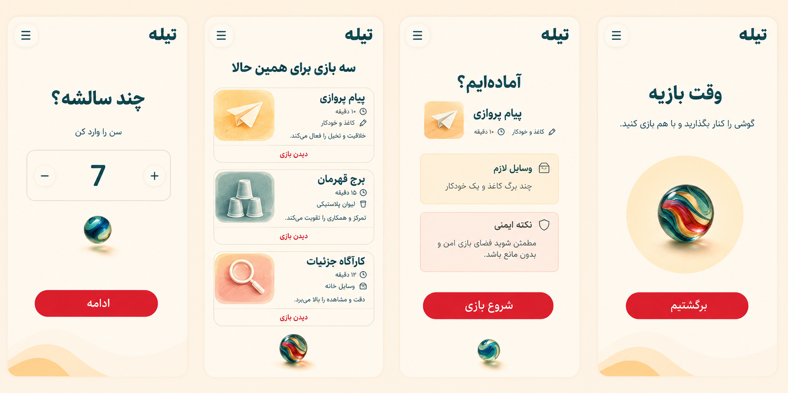

# Priority Flow Visuals v1

Status: APPROVED BY OWNER
Phase: 08 - UI/UX DESIGN
Type: HIGH-FIDELITY STATIC MOCKUPS

## Dark Home

این Variant همان Composition نسخه روشن را حفظ می‌کند. Petrol سطح اصلی است، Cream خوانایی متن را نگه می‌دارد و Ruby تنها Accent تعاملی باقی می‌ماند. این تصویر Theme direction را نشان می‌دهد؛ Contrast عددی در Prototype اجرایی اندازه‌گیری می‌شود.

## Core mobile flow

برد چهار State اولویت‌دار را کنار هم نشان می‌دهد:

1. سؤال سن با یک تصمیم غالب
2. دقیقاً سه Result با زمان، وسایل و دلیل تناسب
3. Detail با وسایل ضروری و Safety پیش از Start
4. Active Play آرام با دعوت به کنارگذاشتن گوشی

نام بازی‌ها و تصاویر داخل این برد فقط Copy نمایشی برای بررسی Layout هستند. آن‌ها Game content تأییدشده، Published یا ورودی Matching محسوب نمی‌شوند.

## Visual rules validated

- هویت Marble در همه Screenها حضور دارد، اما نقش آن در هر صفحه محدود و هدفمند است.
- CTAهای Core در Mobile یک‌خط و نزدیک thumb zone هستند.
- Safety پیش از Start دیده می‌شود.
- Result به سه انتخاب محدود مانده است.
- Active Play از نظر بصری آرام‌تر از Match است.
- صفحات یک Theme پیوسته و یک Radius system دارند.

## Transferred validation after UI/UX Gate

- حالت‌های no-result، Loading، Empty، Error و Offline در دو Theme توسط مالک تأیید شدند.
- Variantهای Desktop برای Result و Detail در دو Theme توسط مالک تأیید شدند.
- Contrast measurement پس از Freeze شدن Tokenهای پیاده‌سازی
- بررسی اجرایی Reflow در 320px، 390px، 768px، 1024px و 1440px
- بررسی Keyboard، Screen reader و Performance در Prototype اجرایی
