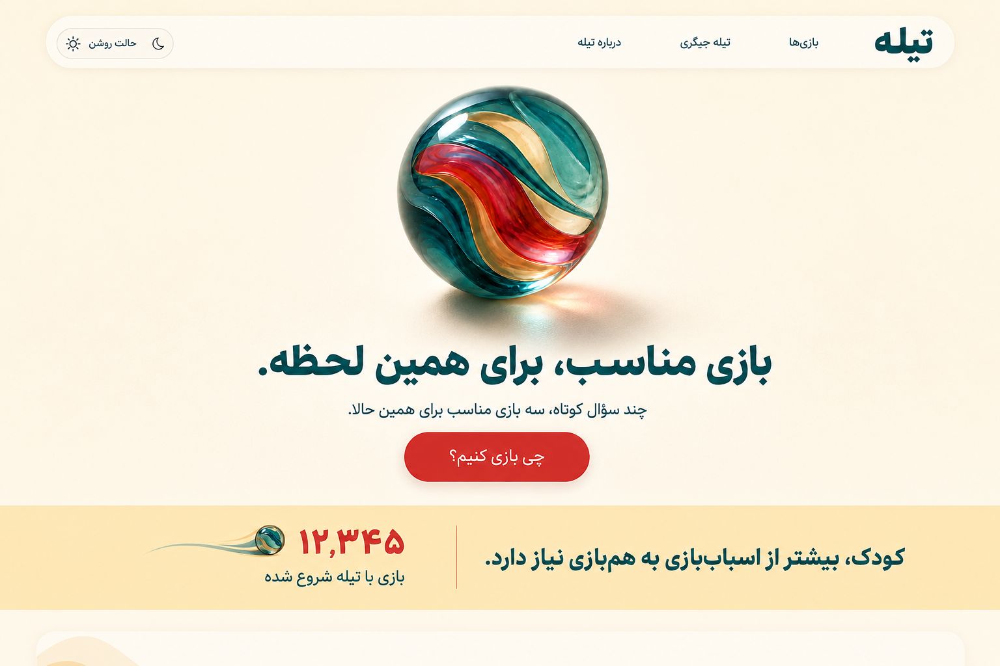
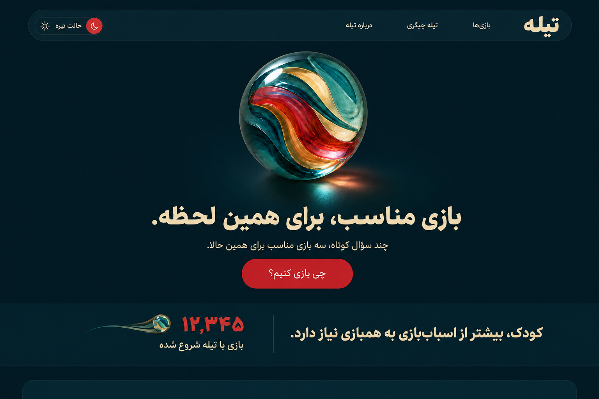
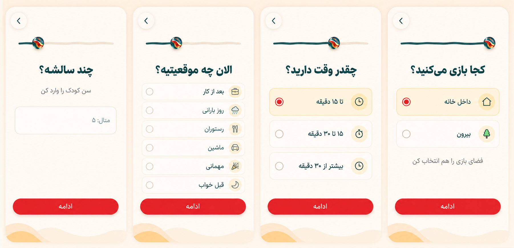
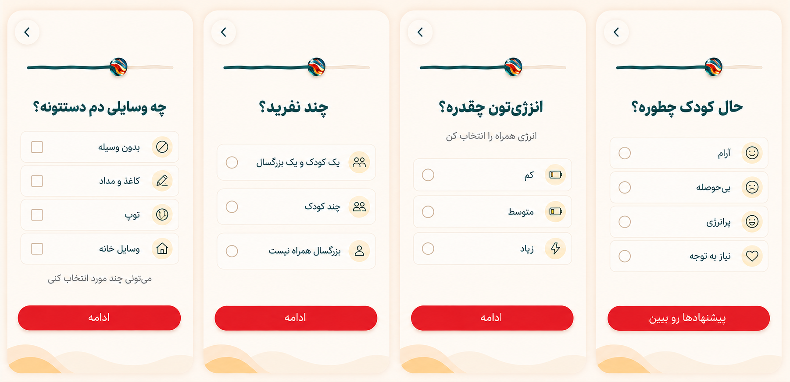
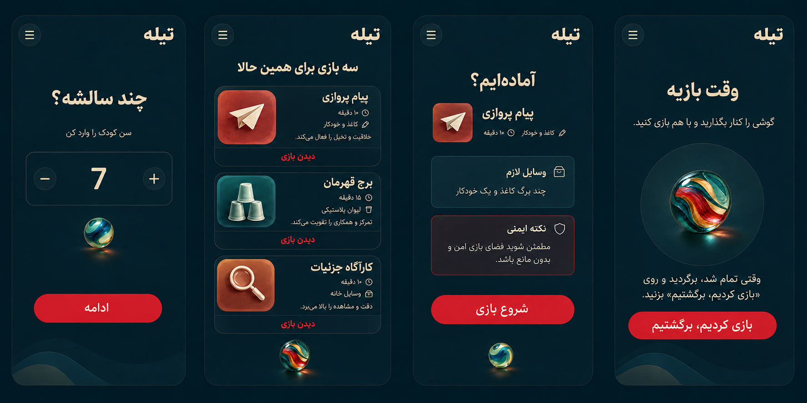

# Owner Review Revisions v2

Status: CLOSED - SUPERSEDED BY APPROVED V4
Phase: 08 - UI/UX DESIGN
Date: 2026-09-03

این بسته به شش نکته Review مالک پاسخ می‌دهد.

## Home light v2

## Home dark v2

Dark surface در v2 صاف است و Texture/Noise نسخه قبلی حذف شده است.

## Essential questions

- Age
- Situation
- Duration
- Location/Space

## Adaptive questions

- Materials
- Players/Adult presence
- Energy
- Mood

این Screenها همگی در یک Match الزاماً نمایش داده نمی‌شوند؛ Context و Hard filter نیاز آن‌ها را تعیین می‌کند.

## Persistent dark flow

این برد ثابت‌بودن Theme را از Context تا Result، Detail و Active Play نشان می‌دهد. آخرین Screen راه بازگشت را توضیح می‌دهد و CTA آن «بازی کردیم، برگشتیم» است.

## Heartbeat data note

عدد `۱۲٬۳۴۵` فقط Sample برای سنجش Layout است. Production باید مقدار aggregate و معتبر `started` را نمایش دهد و هرگز این عدد را hard-code نکند.

## Superseded visuals

Prototypeهای v1 برای History در Repository باقی می‌مانند، اما مرجع Review از این پس فایل‌های v2 این سند هستند.
