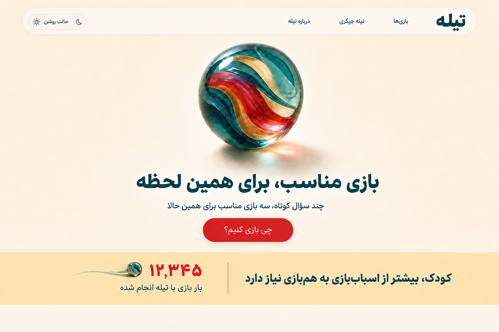
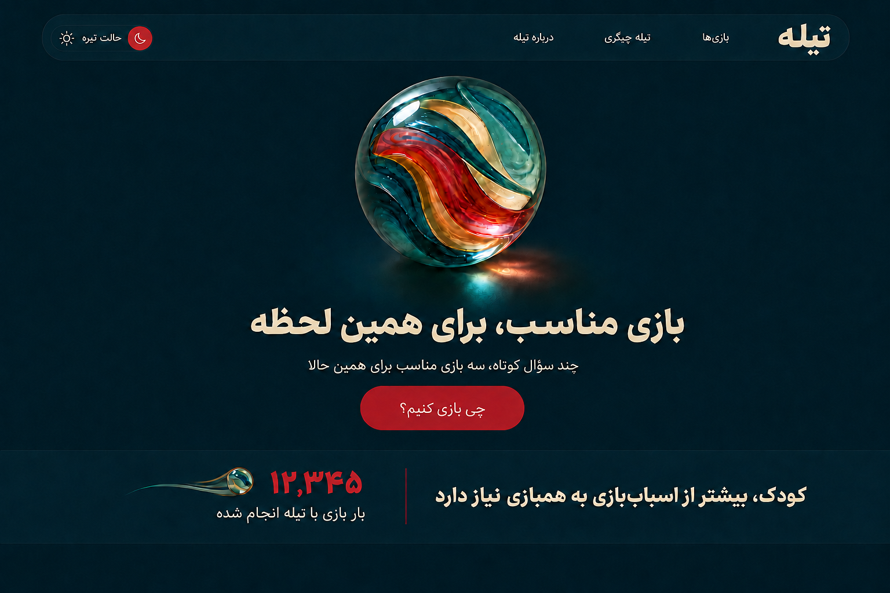

# Homepage Approved v4

Status: APPROVED BY OWNER
Phase: 08 - UI/UX DESIGN
Source decision: DEC-014

## قالب نهایی

قالب تأییدشده همان چیدمان اصلی با تیله بزرگ و مرکزی است. خروجی آزمایشی `exec-c0dc48f8-88ab-4dfd-9324-cc18e45cff82.png` با چیدمان دونیمه‌ای رد شده و مرجع طراحی یا پیاده‌سازی نیست.

## Heartbeat نهایی

الگوی نمایشی نهایی:

`{PLAY_STARTS} بار بازی با تیله انجام شده`

عدد همچنان فقط aggregate معتبر رویداد `started` است؛ تغییر Microcopy تعریف Metric را عوض نمی‌کند.

## Light

## Dark

این دو تصویر مرجع جاری Homepage برای ادامه طراحی و پیاده‌سازی هستند.
