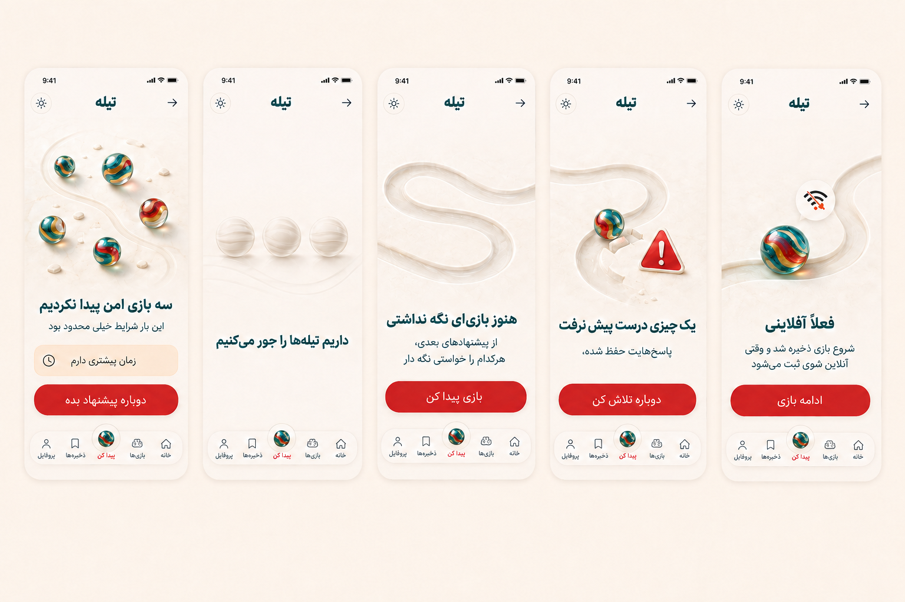
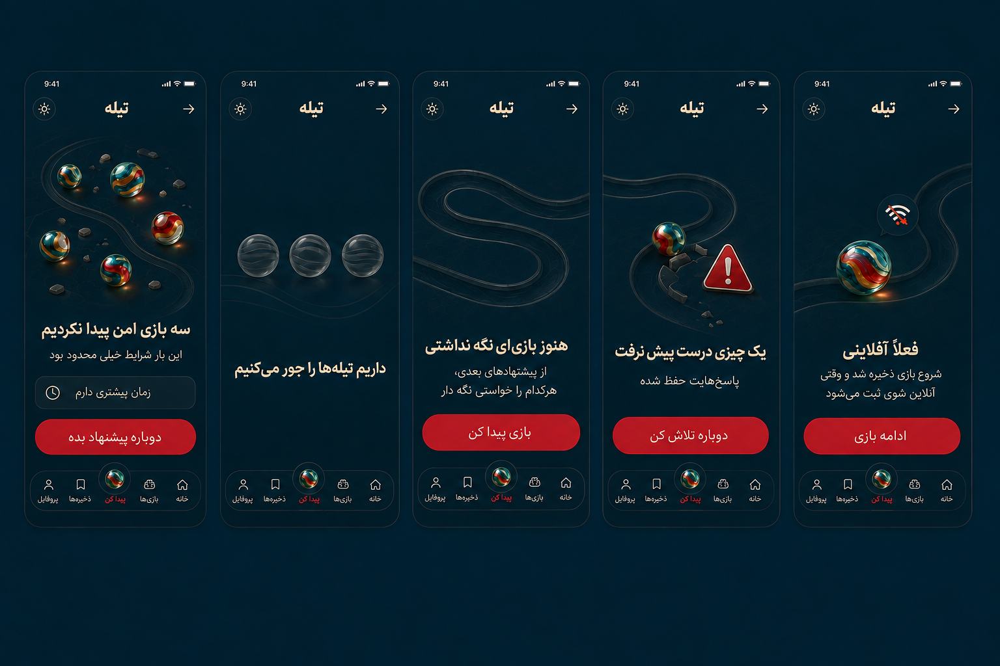

# System States v1

Status: READY FOR OWNER REVIEW
Phase: 08 - UI/UX DESIGN

Design read: رابط محصول برای والدین و مراقبان با زبان Modern Nostalgia × Playful Intelligence و ادامه مستقیم سیستم بصری تأییدشده تیله

Design dials: `8 / 7 / 4`

## No-result

- Heading: «سه بازی امن پیدا نکردیم»
- Explanation: «این بار شرایط خیلی محدود بود»
- Safe suggestion example: «زمان بیشتری دارم»
- CTA: «دوباره پیشنهاد بده»
- Safety و Age هرگز پیشنهاد Relax نمی‌شوند و تغییر Constraint فقط با اقدام آگاهانه کاربر انجام می‌شود.

## Loading

- Heading: «داریم تیله‌ها را جور می‌کنیم»
- سه Skeleton هم‌شکل Result نمایش داده می‌شود و Spinner عمومی استفاده نمی‌شود.
- حرکت نور فقط انتظار را نشان می‌دهد و در reduced-motion خاموش است.

## Empty saved games

- Heading: «هنوز بازی‌ای نگه نداشتی»
- Explanation: «از پیشنهادهای بعدی، هرکدام را خواستی نگه دار»
- CTA: «بازی پیدا کن»

## Contextual error

- Heading: «یک چیزی درست پیش نرفت»
- Preservation copy: «پاسخ‌هایت حفظ شده»
- CTA: «دوباره تلاش کن»
- خطا با Icon و Copy منتقل می‌شود و فقط به رنگ متکی نیست.

## Offline active play

- Heading: «فعلاً آفلاینی»
- Queue copy: «شروع بازی ذخیره شد و وقتی آنلاین شوی ثبت می‌شود»
- CTA: «ادامه بازی»
- Sync مجدد نباید Play Start تکراری بسازد.

## Shared interaction contract

- Touch target حداقل 44×44 CSS pixel است.
- CTAها در Desktop و Mobile تک‌خطی می‌مانند.
- وضعیت‌ها در live region مناسب اعلام می‌شوند.
- Focus پس از تغییر State روی Heading یا Recovery action منطقی قرار می‌گیرد.
- حرکت فقط Feedback یا State transition را توضیح می‌دهد و Loop تزئینی ندارد.
- Theme در تمام مسیر پایدار می‌ماند و هر پنج State در نسخه روشن و تیره مرجع دارند.
- Visual review کنتراست هر دو Theme انجام شده است؛ اندازه‌گیری عددی WCAG پس از Freeze شدن Tokenهای پیاده‌سازی انجام می‌شود.
