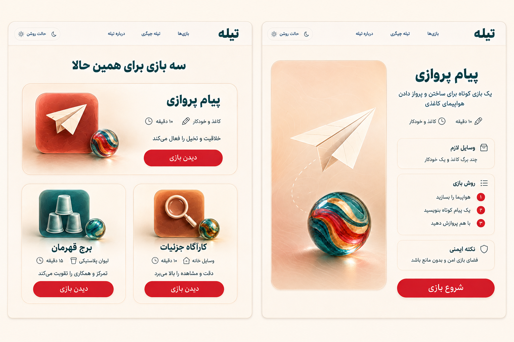
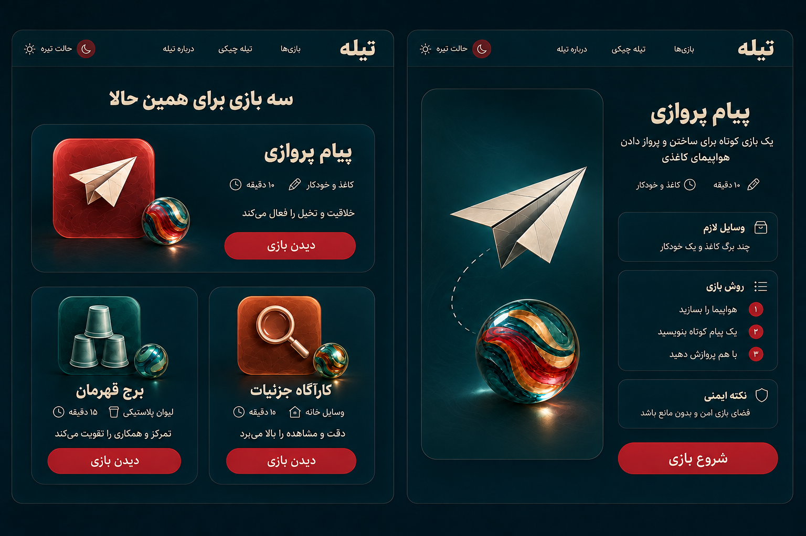

# Desktop Results and Game Detail v1

Status: READY FOR OWNER REVIEW
Phase: 08 - UI/UX DESIGN

## Light

## Dark

## Results contract

- خروجی موفق دقیقاً سه بازی یکتا نشان می‌دهد.
- Desktop از ترکیب نامتقارن 1+2 استفاده می‌کند؛ Result اصلی بزرگ‌تر است اما انتخاب اجباری ایجاد نمی‌کند.
- هر Result نام، زمان، وسیله ضروری، دلیل تناسب و CTA «دیدن بازی» دارد.
- پرداخت، Sponsor یا عضویت ترتیب Resultها را تغییر نمی‌دهد.
- اگر کمتر از سه Survivor معتبر وجود داشته باشد این صفحه نمایش داده نمی‌شود و no-result صریح جایگزین آن است.

## Game Detail contract

- Summary، زمان و وسیله پیش از Fold اصلی قابل خواندن‌اند.
- وسایل لازم، روش بازی و نکته ایمنی پیش از CTA «شروع بازی» قرار دارند.
- CTA در Desktop تک‌خطی است و روی Mobile نزدیک Thumb zone قرار می‌گیرد، بدون پوشاندن Safety.
- اگر بازی پیش از Start از حالت Published خارج شود، Unavailable state و Re-match نمایش داده می‌شود.

## Theme and motion

- ساختار و ترتیب اطلاعات در Light و Dark یکسان است.
- تغییر Theme نباید Scroll position یا Match session را از بین ببرد.
- Resultها با stagger کوتاه وارد می‌شوند تا ترتیب خواندن روشن شود.
- ورود Detail از تصویر Result به تصویر اصلی با shared-element transition کوتاه انجام می‌شود.
- reduced-motion همه حرکت‌ها را به fade حداکثر 120ms تبدیل می‌کند.

## Pending validation

- Reflow در عرض‌های 320، 390، 768، 1024 و 1440 پیکسل
- اندازه‌گیری عددی Contrast پس از Freeze شدن Tokenها
- Keyboard order و Screen-reader announcement در Prototype اجرایی
